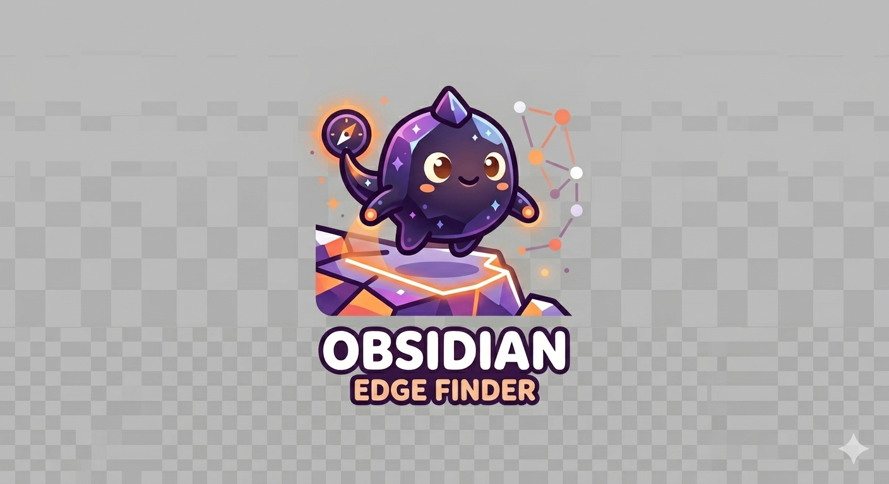

# obsidian-edge-finder

<p align="center">
  
</p>

A lightweight tool that finds missing connections in an Obsidian vault and
proposes `[[wikilinks]]` you can review and accept as a batch.

## Should you use this?

**Probably try these first** — they cover most cases without writing any code:

- [Smart Connections](https://github.com/brianpetro/obsidian-smart-connections) — embeddings-based "related notes" pane, supports local Ollama.
- [Note Linker](https://github.com/AlexW00/obsidian-note-linker) — proposes links wherever one note's title appears in another's body.
- [Graph Analysis](https://github.com/SkepticMystic/graph-analysis) — analytical view of your vault's structure, including co-citations.

**This tool is for the case where:**

- You're a Claude Code subscriber and would rather have Claude itself drive the edge-proposal pass than run a separate Ollama server or pay for an API key.
- You want batch-reviewable proposals (`proposals.md` with checkboxes) rather than a sidebar pane.
- You want a one-shot **gaps report** that surfaces islands, load-bearing notes, and centerless loops in your vault.

## Status

Early. Today only the `scan` command works — it produces a read-only
`vault-report.md` with statistics, detected note shapes, a draft
ontology, and a topology gaps section. `propose` and `apply` come next.

## Usage

```bash
pip install -e .
edge-finder scan /path/to/vault
# → writes vault-report.md and .edge-finder/ontology.draft.yaml into the vault
```

Open `vault-report.md` in Obsidian, edit the draft ontology if anything
looks off, then (eventually) run `edge-finder propose`.

If `scan` reports a **📌 Stub corpora detected** section, run
`edge-finder triage` first — see [Stub corpora and bookmark
imports](#stub-corpora-and-bookmark-imports) below.

## What `scan` looks at

- All `.md` files outside `.obsidian/`, `.trash/`, and the tool's own `.edge-finder/` dir.
- YAML frontmatter (if present), body text, existing `[[wikilinks]]`, `#tags`, `@mentions`.
- Filename and folder conventions.
- The structure of section headers (e.g. Granola's `## Summary` / `## Attendees`).

It does **not** read note content beyond what's needed to detect shape and
extract existing links. No LLM call, no embedding, no network.

## Stub corpora and bookmark imports

A common Obsidian failure mode: you bulk-import a thousand bookmarks
from Pocket, Raindrop, Instapaper, Notion, or browser sync, and end up
with a folder of structured-but-empty notes — each one has a URL,
title, and tags, but no body content and no outgoing wikilinks. We
call this a **stub corpus**. It silently breaks the rest of
edge-finder:

- `propose --plan` flags every stub as a candidate, but TF-IDF
  matches on noise (`url`, `pocket`, `folder`, `source`).
- `propose --judge` correctly skips them under "precision over
  recall" — there's no semantic content to write a confident edge
  rationale about.
- The user sees zero new edges across thousands of notes and
  reasonably wonders what the tool is doing.

The triage workflow handles this case directly. `scan` now detects
stub corpora and surfaces them in the report. `edge-finder triage`
then proposes `stub → hub` edges by matching each stub's frontmatter
tags against existing hub-shaped notes (`*Kanban*`, `*Index*`,
`*Overview*`, `*Hub*`, `*Map*` — outside of content folders like
`books/`).

```bash
edge-finder scan /path/to/vault         # detects "📌 Stub corpora" section
edge-finder triage /path/to/vault       # writes triage-plan.md
# review checkboxes in triage-plan.md, uncheck anything wrong
edge-finder triage --apply /path/to/vault
# → adds `## See also\n- [[hub]]\n` to each checked stub
# → writes a backup tarball to .edge-finder/backups/triage-*.tar
```

The mutation is conservative on purpose:

- Only the stub is modified — the hub is **not** updated. Adding 1k
  inbound bullets to a hub would clutter it. The forward edge
  (stub → hub) is sufficient for graph traversal and Obsidian's
  backlinks panel.
- Only filename-pattern hubs count. Notes in `books/`, `web-clips/`,
  `Clippings/`, `daily/`, `07_Bookmarks/` are excluded as candidate
  hubs, even if they have high in-degree from cross-references —
  they're content, not hubs.
- Tag matching is deterministic substring containment on normalized
  names. No LLM, no embeddings.

Tested at scale: a 2,673-note vault with 2,365 stubs produced 128
high-confidence `#climate → 🌍 Climate Science Kanban.md`
attachments in seconds, all of which inspected as valid topical
links. The remaining 2,237 stubs had no usable tag-hub match and
were left for manual review (most were URL-only without topical
metadata; the right path for those is to re-clip via Obsidian Web
Clipper to enrich them with body content).

See [`docs/triage-spec.md`](docs/triage-spec.md) for the full design.
